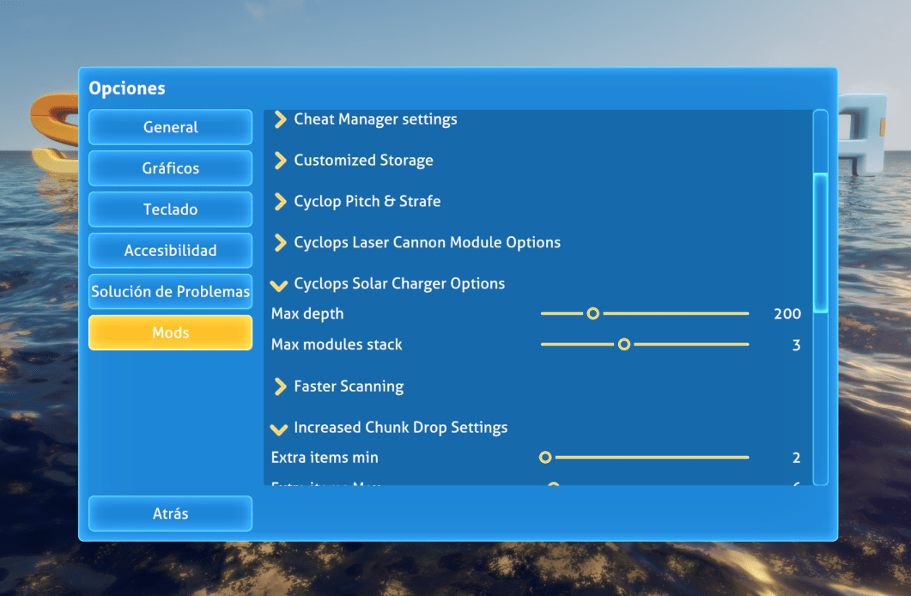
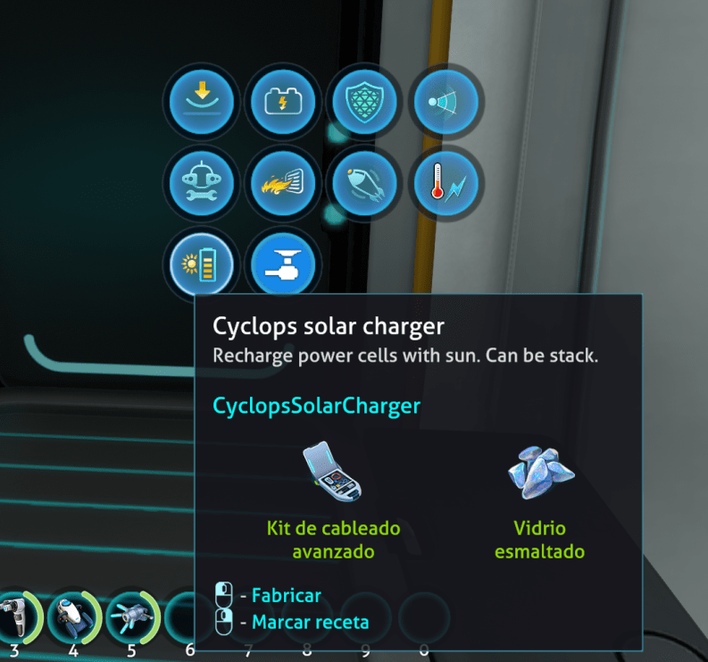


# Subnautica Cyclops Solar Charger (BepInEx)

Solar energy is clean and efficient. We can charge our Seamoth with the sun, wouldn't it be wonderful to be able to charge the Cyclops as well?

Cyclops Solar Charge upgrade allows you to charge your buddy's power cells with clean solar power.

## Acknowledgements

- [Mroshaw](https://mroshaw.github.io/) for the amazing tutorials
- [BepInEx](https://github.com/BepInEx/BepInEx) for making modding easier
- [SML Helper](https://github.com/SubnauticaModding/SMLHelper) for making our life much easier to make subnautica mods
- [MrPurple6411](https://github.com/MrPurple6411/MrPurple6411-Subnautica-Mods) and [Senna7608](https://github.com/Senna7608) for your amazing mods, I took a look to your code for examples and inspiration <3

## Features

The upgrade module is unlocked along with the Cyclops and is fabricated in the fabricator inside the Cyclops.

### Take depth in account!

By default the chargers will work up to 200m (can be configured up to 800m), but the closer to the surface you are the more intense the sun and the more charge you will get, the deeper you are the less electrical charge.

### Stackable

Can be stacked up to 3 times (configurable up to 6) to get better charging rates.

At 100 meters:

- With one module you will be able to energy to move without worrying about running out of energy.
- With two modules you will be able to move, use the sonar and turn on the defensive shield in times of emergency.
- With three modules you will be able to have the defensive shield on for a long time without any problem

I tried to balance the charging rate to not be cheating, if you want more charging rate you can increase the max depth and the max stack options

### Mid game

You will unlock the Cyclops Solar Charger together with the Cyclops,
the recipe to craft this upgrade is the same as the [Seamoth Solar Charger](https://subnautica.fandom.com/wiki/Seamoth_Solar_Charger):
- 1 [Advanced wiring kit](https://subnautica.fandom.com/wiki/Advanced_Wiring_Kit_(Subnautica))
- 1 [Enameled Glass](https://subnautica.fandom.com/wiki/Enameled_Glass_(Subnautica))

You can craft the upgrade inside the Cyclops

### Configurable

- The maximum number of modules to stack can be configured between 1 and 6.
- The maximum operating depth can be set up to 800m.
- The recharge speed multiplier allows decreasing or increase (from 0.5 to 4) the recharge speed. This parameter is applied as a multiplier, default 1 (default recharge speed), if set to 2, the recharge will be twice as fast.
- 
## Installation

### Requirements
- [BepInEx 5.4.21](https://www.nexusmods.com/subnautica/mods/1108)
- [SMLHelper 2.15](https://www.nexusmods.com/subnautica/mods/113)

### Install with Vortex
Just press the button :)

### Manual install
- You must have [BepInEx Subnautica Pack](https://www.nexusmods.com/subnautica/mods/1108) and [SMLHelper (Modding Helper)](https://www.nexusmods.com/subnautica/mods/113) installed.
- Extract the CyclopsSolarCharger archive into your BepInEx\plugins\ folder.

## Recommended mods
- [Slot Extender](https://www.nexusmods.com/subnautica/mods/142) allow to put more upgrades in the Cyclops and the Sheamoth

## License

[MIT](https://choosealicense.com/licenses/mit/)

