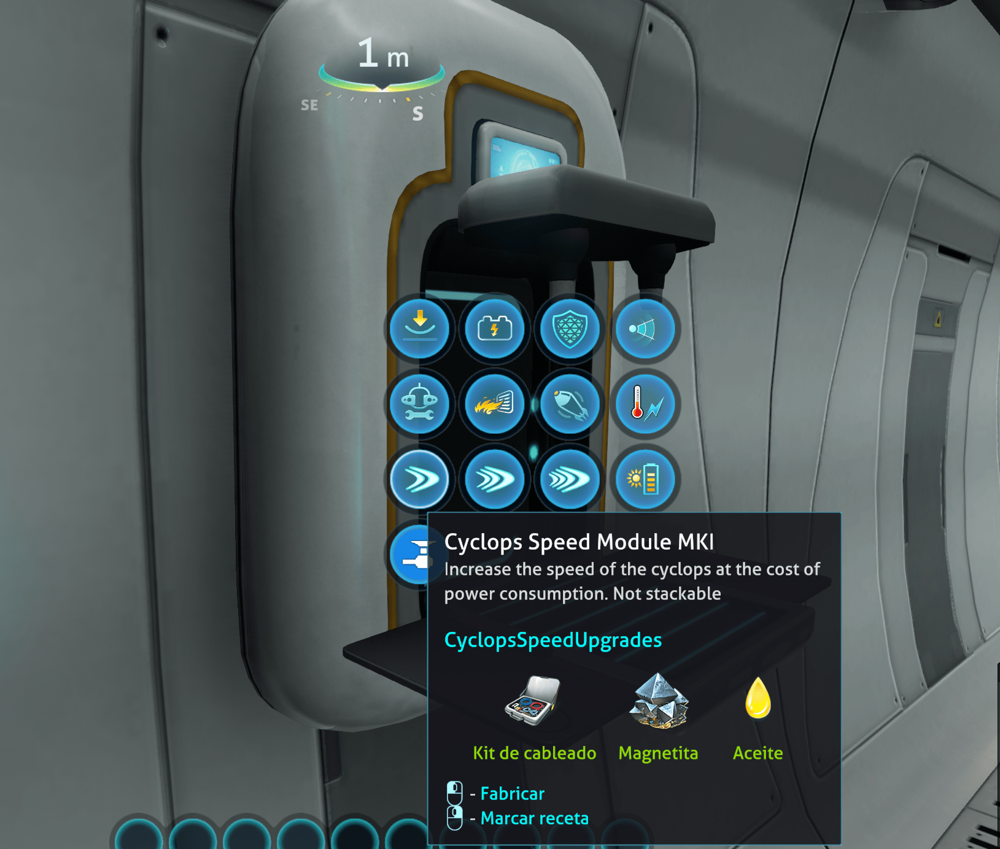

# Subnautica Cyclops Speed Upgrades (BepInEx)

Go faster, much faster!

Four new modules to craft for the Cyclops to increase the speed up to 500% (6x times faster than vanilla).

## Acknowledgements

- [Mroshaw](https://mroshaw.github.io/) for the amazing tutorials
- [BepInEx](https://github.com/BepInEx/BepInEx) for making modding easier
- [SML Helper](https://github.com/SubnauticaModding/SMLHelper) for making our life much easier to make subnautica mods
- [PrimieSonic](https://github.com/PrimeSonic/PrimeSonicSubnauticaMods/tree/master/CyclopsSpeedUpgrades) for the original mod

## Features

The modules are unlocked along with the Cyclops and can be fabricated inside the Cyclops.

Each module increases the speed and the power consumption.

### CyclopsSpeedModuleMKI

Increases:
- forward speed by 100%, you will go 2x times faster than vanilla
- power consumption by 30%

Recipe:
- 1 [Computer chip](https://subnautica.fandom.com/wiki/Computer_Chip_(Subnautica))
- 1 [Magnetite](https://subnautica.fandom.com/wiki/Magnetite_(Subnautica))
- 1 [Lubricant](https://subnautica.fandom.com/wiki/Lubricant_(Subnautica))

### CyclopsSpeedModuleMKII

Increases:
- speed by 200%, you will go 3x times faster than the vanilla
- vertical speed by 20%
- rotation speed (torque) by 10%
- power consumption by 60%

Recipe:
- 1 CyclopsSpeedModuleMKI
- 1 [Wiring kit](https://subnautica.fandom.com/wiki/Wiring_Kit_(Subnautica))
- 1 [Lithium](https://subnautica.fandom.com/wiki/Lithium_(Subnautica))

### CyclopsSpeedModuleMKIII

Increases:
- speed by 300%, you will go 4x times faster than vanilla
- vertical speed by 30%
- rotation speed (torque) by 20%
- power consumption by 100%, twice the energy consumption.

Recipe:
- 1 CyclopsSpeedModuleMKII
- 1 [Advanced Wiring Kit](https://subnautica.fandom.com/wiki/Advanced_Wiring_Kit_(Subnautica))
- 1 [Ion Cube](https://subnautica.fandom.com/wiki/Ion_Cube_(Subnautica))

### CyclopsSpeedModuleMKIIII

Increases:
- speed by 500%, you will go 6x times faster than vanilla O.O
- vertical speed by 50%
- rotation speed (torque) by 40%
- power consumption by 200%, 3x more energy consumption.

Recipe:
- 1 CyclopsSpeedModuleMKII
- 1 [Ion Power Cell](https://subnautica.fandom.com/wiki/Ion_Power_Cell_(Subnautica))
- 1 [Kyanite](https://subnautica.fandom.com/wiki/Kyanite_(Subnautica))

## Installation

### Requirements
- [BepInEx 5.4.21](https://www.nexusmods.com/subnautica/mods/1108)
- [SMLHelper 2.15](https://www.nexusmods.com/subnautica/mods/113)

### Install with Vortex
Just press the button :)

### Manual install
- You must have [BepInEx Subnautica Pack](https://www.nexusmods.com/subnautica/mods/1108) and [SMLHelper (Modding Helper)](https://www.nexusmods.com/subnautica/mods/113) installed.
- Extract the CyclopsSpeedUpgrades archive into your BepInEx\plugins\ folder.

## Recommended mods
- [Slot Extender](https://www.nexusmods.com/subnautica/mods/142) increases the number of installable upgrades in the Cyclops and the Sheamoth
- [Cyclops Solar Charger](https://www.nexusmods.com/subnautica/mods/1209) allows recharging the cyclops with the sun

## License

[MIT](https://choosealicense.com/licenses/mit/)

