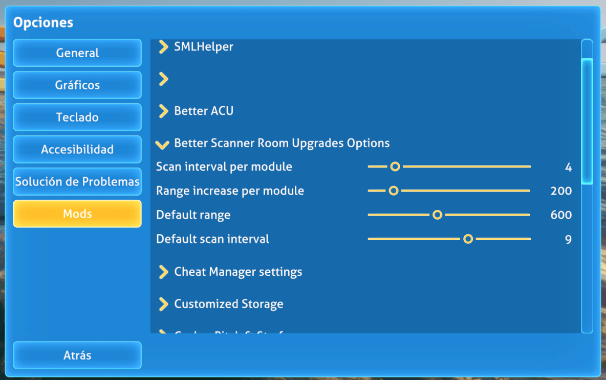
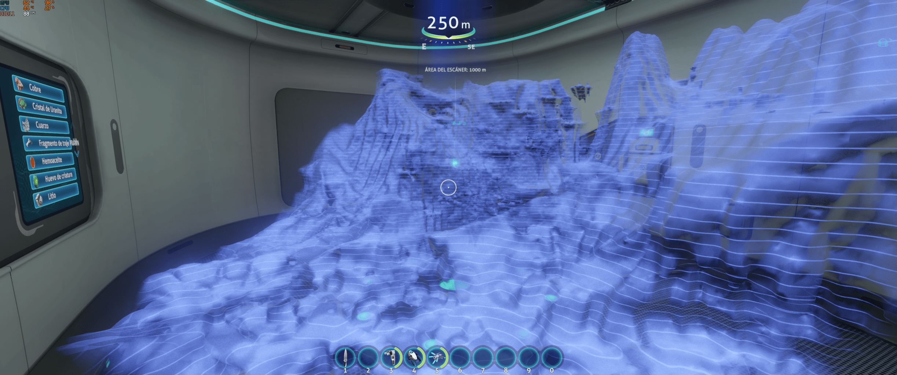

# Subnautica Better Scanner Room Upgrades (BepInEx)

Better upgrades for the Scanner Room:
- More range, up to 1000m
- Faster scans
- Reduce power consumption
- Configurable

With the default configuration, with 2 range upgrades and 2 speed upgrades you will get the
maximum range and speed for your Scanner Room.

By default each power efficiency upgrade will reduce the power consumption by 20%.

## Acknowledgements

- [Mroshaw](https://mroshaw.github.io/) for the amazing tutorials
- [BepInEx](https://github.com/BepInEx/BepInEx) for making modding possible
- [SML Helper](https://github.com/SubnauticaModding/SMLHelper) for making our life much easier to make subnautica mods
- [Original BetterScannerRoom mod](https://github.com/Metious/BetterScannerRoom) for the inspiration

## Features

Increase the maximum scanning speed, the maximum range and reduce the power consumption.

### Power efficiency

A new upgrade can be crafted in the Scanner room fabricator, the Scanner room power efficiency upgrade.

Each upgrade installed will reduce the power consumption by 20% (configurable).

The maximum total power reduction is 90%.

You can configure how much power consumption optimize per upgrade, so if for example you configure directly 90%,
with only one upgrade you will get the max power efficiency.

### More range

Vanilla values:
- Initial range: 300m
- Maximum range with all 4 range upgrades: 500m
- Range increase per range upgrade: 50m

With Better Scanner Room Upgrades:
- Initial range: 600m (configurable)
- Maximum range: 1000m
- Maximum range achievable with only 2 range upgrades
- Range increase per range upgrade: 200m (configurable)

Please, take into account that, for performance reasons, the maximum scanning range is 1000m, but
you can configure how to reach that 1000m.

You can configure how much range to increase per upgrade and how much range the scanner have without upgrades.

By default, with only 2 upgrades you will have the maximum range.

### Faster scans

In vanilla, without speed upgrades, the Scanner Room takes 14 seconds to find a resource,
and with all the 4-speed upgrades, it will take 2 seconds.

This is called an interval, the time the game waits before finding another resource.

Vanilla values:
- Initial interval: 14 seconds to find a resource
- Minimum interval with all 4-speed upgrades: 2 seconds
- Interval decrease per speed upgrade: 3 seconds (14s - (3s * num of upgrades))

With Better Scanner Room Upgrades:
- Initial interval: 9 seconds to find a resource (configurable)
- Minimum interval: 1 second
- Max speed achievable with only 2-speed upgrades.
- Interval decrease per speed upgrade: 4 seconds (configurable)

Please, take into account that, for performance reasons, the minimum interval is 1 second.

You can configure how much speed to gain per upgrade and how fast is the scanner without upgrades.

By default, with only 2 upgrades you will have the maximum speed.

## Installation

### Requirements
- [BepInEx 5.4.21](https://www.nexusmods.com/subnautica/mods/1108)
- [SMLHelper 2.15](https://www.nexusmods.com/subnautica/mods/113)

### Install with Vortex

Just press the button :)

### Manual install

- You must have [BepInEx Subnautica Pack](https://www.nexusmods.com/subnautica/mods/1108) and [SMLHelper (Modding Helper)](https://www.nexusmods.com/subnautica/mods/113) installed.
- Extract the Better Scanner Room Upgrades archive into your BepInEx\plugins\ folder.

### Roadmap

- Create a new upgrade to improve the power efficiency

## License

[MIT](https://choosealicense.com/licenses/mit/)
