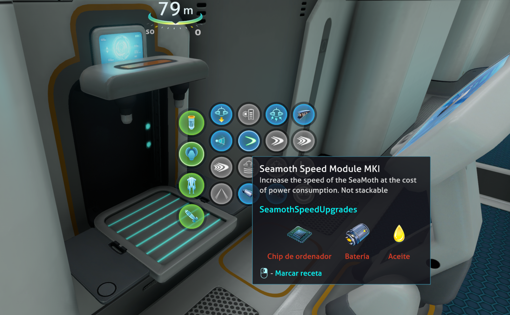

# Subnautica SeaMoth Speed Upgrades (BepInEx)

Some insane speed upgrades for the SeaMoth.

Four new modules to craft for the SeaMoth to increase the speed up to 500%.

## Acknowledgements

- [Mroshaw](https://mroshaw.github.io/) for the amazing tutorials
- [BepInEx](https://github.com/BepInEx/BepInEx) for making modding easier
- [SML Helper](https://github.com/SubnauticaModding/SMLHelper) for making our life much easier to make subnautica mods

## Features

The modules are unlocked along with the SeaMoth, can be fabricated in the [Moonpool Vehicle Upgrade Console](https://subnautica.fandom.com/wiki/Vehicle_Upgrade_Console_(Subnautica))

Although the most logical decision would be to fabricate all the modules in the vehicle console of the Moonpool,
I have done it this way to have early access to the first speed increase :)

Each module increases the speed and the power consumption.

### SeaMothSpeedModuleMKI

Increases speed by 100% and the power consumption by 25%, you will go 2 times faster than vanilla.

Can be fabricated in the regular fabricator.

Recipe:
- 1 [Computer chip](https://subnautica.fandom.com/wiki/Computer_Chip_(Subnautica))
- 1 [Battery](https://subnautica.fandom.com/wiki/Battery_(Subnautica))
- 1 [Lubricant](https://subnautica.fandom.com/wiki/Lubricant_(Subnautica))

### SeaMothSpeedModuleMKII

Increases speed by 200% and the power consumption by 50%, you will go 3 times faster than vanilla.

Recipe:
- 1 SeaMothSpeedModuleMKI
- 1 [Wiring kit](https://subnautica.fandom.com/wiki/Wiring_Kit_(Subnautica))
- 1 [Power Cell](https://subnautica.fandom.com/wiki/Power_Cell_(Subnautica))
- 1 [Magnetite](https://subnautica.fandom.com/wiki/Magnetite_(Subnautica))

### SeaMothSpeedModuleMKIII

Increases speed by 300% and the power consumption by 100%, you will go 4 times faster than the original at cost of twice the energy consumption.

Recipe:
- 1 SeaMothSpeedModuleMKII
- 1 [Advanced Wiring kit](https://subnautica.fandom.com/wiki/Advanced_Wiring_Kit_(Subnautica))
- 1 [Aerogel](https://subnautica.fandom.com/wiki/Aerogel_(Subnautica))
- 1 [Ion Cube](https://subnautica.fandom.com/wiki/Ion_Cube_(Subnautica))

### SeaMothSpeedModuleMKIIII

Increases speed by 400% and the power consumption by 200%, you will go 5 times faster than the original at cost of 3 times more energy consumption.

Recipe:
- 1 SeaMothSpeedModuleMKII
- 1 [Advanced Wiring kit](https://subnautica.fandom.com/wiki/Advanced_Wiring_Kit_(Subnautica))
- 1 [Ion Power Cell](https://subnautica.fandom.com/wiki/Ion_Power_Cell_(Subnautica))
- 1 [Kyanite](https://subnautica.fandom.com/wiki/Kyanite_(Subnautica))

## Installation

### Requirements
- [BepInEx 5.4.21](https://www.nexusmods.com/subnautica/mods/1108)
- [SMLHelper 2.15](https://www.nexusmods.com/subnautica/mods/113)

### Install with Vortex
Just press the button :)

### Manual install
- You must have [BepInEx Subnautica Pack](https://www.nexusmods.com/subnautica/mods/1108) and [SMLHelper (Modding Helper)](https://www.nexusmods.com/subnautica/mods/113) installed.
- Extract the SeaMothSpeedUpgrades archive into your BepInEx\plugins\ folder.

## Recommended mods
- [Slot Extender](https://www.nexusmods.com/subnautica/mods/142) allow to put more upgrades in the SeaMoth and the Seamoth
- [Seamoth Sprint](https://www.nexusmods.com/subnautica/mods/1197) by RamuneNeptune
- [More Seamoth Depth Modules](https://www.nexusmods.com/subnautica/mods/1135) by MrPurple6411
- [Seamoth Thermal Reactor](https://www.nexusmods.com/subnautica/mods/1139) by MrPurple6411
- [Seamoth Arms](https://www.nexusmods.com/subnautica/mods/365) arms for your Seamoth as the Prawn has. By senna7608
- [Seamoth Energy Shield](https://www.nexusmods.com/subnautica/mods/280) by senna7608

## License

[MIT](https://choosealicense.com/licenses/mit/) 

